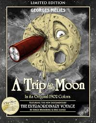
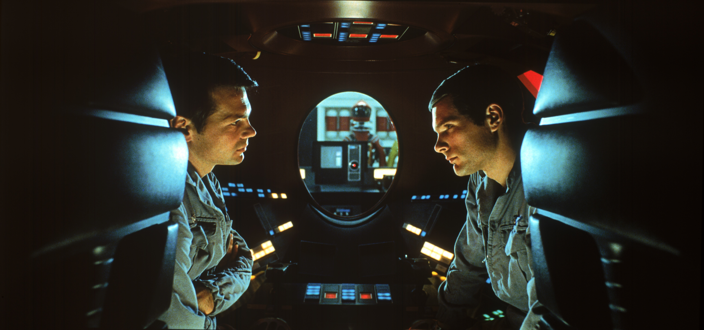
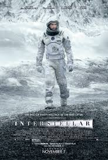
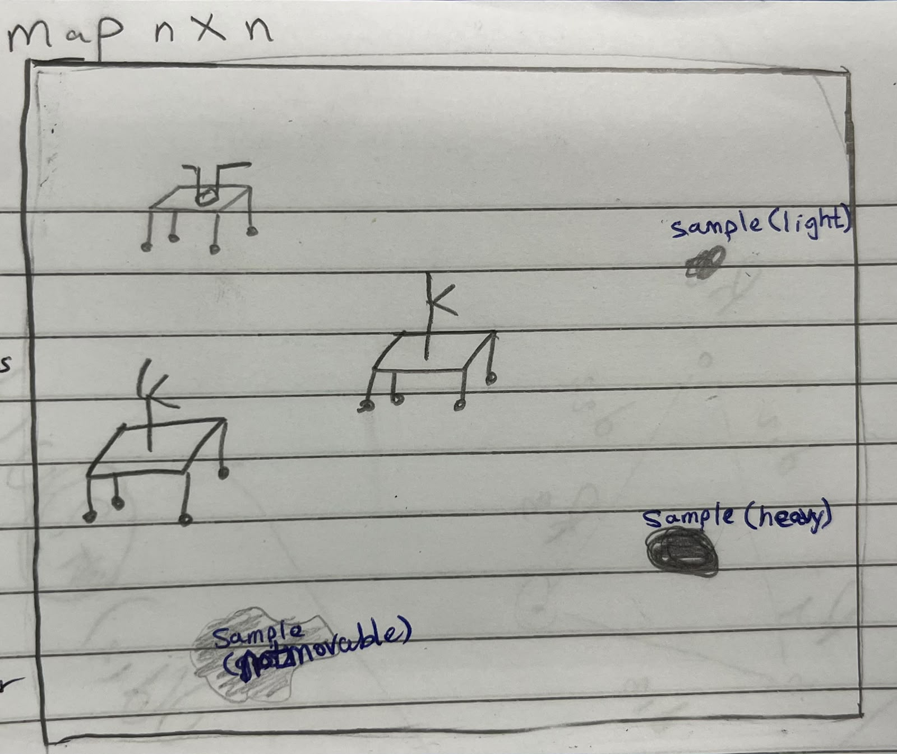
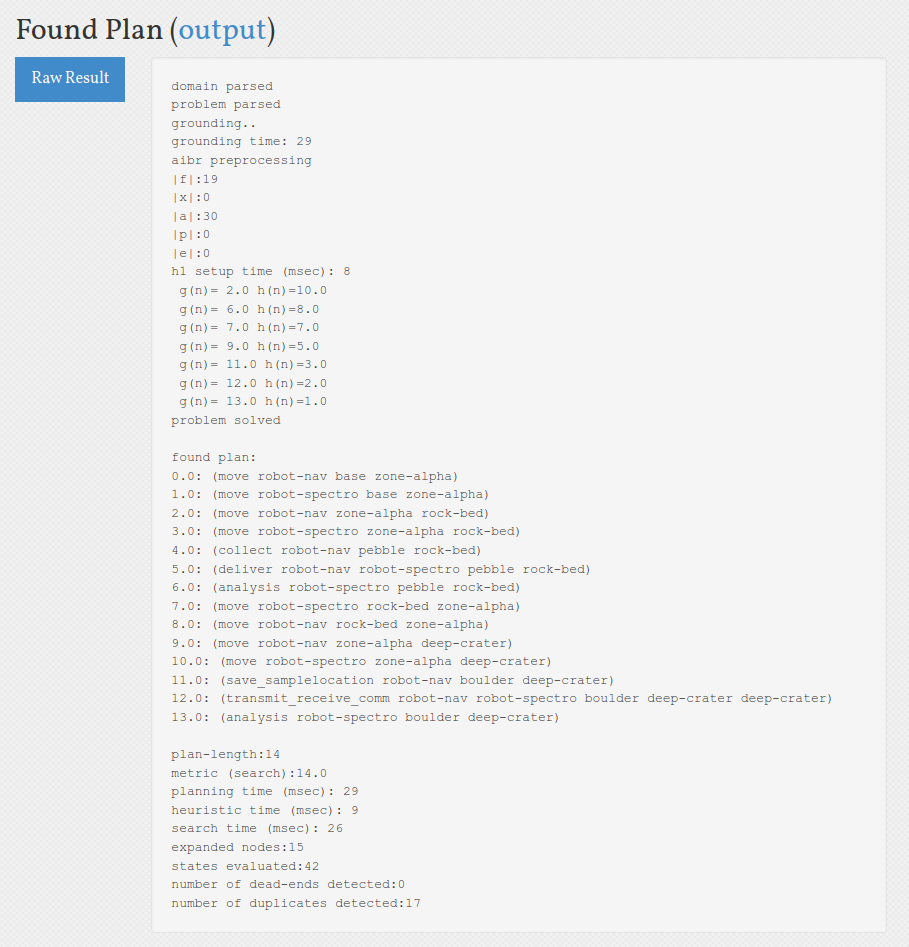
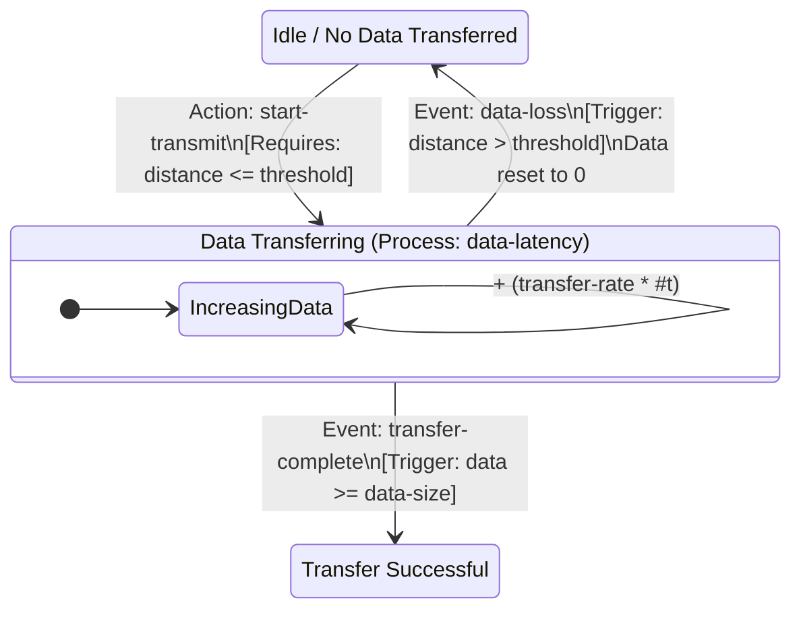
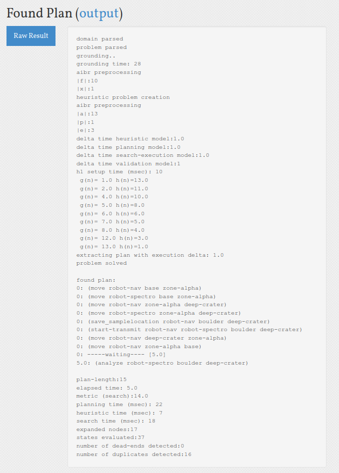

# Planetary Rover Distributed Sensing and Cooperation

## Introduction

Since long time people have always wanted to reach the moon. Even in movies back then this was a hot topic. A film like a trip to the moon proves that. [A Trip to the moon banner](assets/TripToTheMoon.jpeg). When they already got there, they wanted to explore and exploit the other planets minerals and gazes. So now What about AI? Back then (and till now) they have had a false impression about AI; it can control you like in the movie Space Odyssey. [A Space Odyssey](assets/ASpaceOdyssey.jpg).
Other concerns may arise regarding astronauts, what if they went and lost there? like the movie interstellar [Interstellar](assets/Interstellar.jpeg).

  
  
  

So We introduce this multidisciplinary system to plan the system of multi rovers autonomously operated. 

## Abstract
In general the rocket launch from earth, leave the atmosphere level, then go to the target planet, and finally lands on it. The part that lands is called the lander and there are also navigators to explore the planet or the moon the lander on. In general the lander does in situ (real-time testing conducted directly at the sample's original location or within its natural process environment) analysis and the navigators transfer data and samples to the lander.
In our scenario, there is a team of rovers operates together. While all rovers can navigate
and collect samples, only one rover is equipped with a spectrometer capable of
performing in-situ analysis. We could call it **spectrometer**, but it is called **lander** in the general case.
Other rovers or we could call them here **navigators** collect samples and deliver them to the  **Spectrometer** or coordinate the **Spectrometer** to specific locations.
For Communication, we are using the logic of Transmitting/Receiving technique. 

## Methodology & Result

### Part 1: Basic PDDL Model (Discrete Logic & Coordination)

The foundation of the architecture relies on a symbolic, graph-based spatial model encoded in standard PDDL. This phase of the project models heterogeneous agents, distinct operational roles, and mandatory physical or data-driven cooperation.

#### Environment & Agent Representation
The terrain is abstracted as a waypoint graph using a (connected ?l1 ?l2) predicate, forcing the rovers to navigate linearly through specific nodes. In the context of planning, this creates a "fictional interface" that deliberately abstracts away the continuous geometry and kinodynamic constraints of the real world to keep the symbolic search tractable.

- Navigator Rover: A highly mobile agent equipped with grippers for light objects and sensors to log coordinates. It lacks analysis capabilities.

- Spectrometer Rover: A specialized agent that contains the only analysis hardware. It relies entirely on the Navigator to bring it physical samples or spatial data.

  

#### Sample Logic & Explicit Transfer
To ensure analysis is not universally available, the analysis action is strictly restricted to the Spectrometer rover. Furthermore, the domain forces cooperation by categorizing samples by weight, creating two distinct dependency paths:

- Physical Cooperation (Light Samples): The Navigator must execute a collect action to pick up a light sample (e.g., a pebble). It must then navigate to the Spectrometer's location and execute a deliver action, which drops the sample and triggers the (sample-delivered) flag.

- Data Cooperation (Heavy Samples): Heavy samples (e.g., boulders) cannot be moved. The Navigator must reach the sample, execute save_samplelocation to log the coordinates, and rendezvous with the Spectrometer. Using the transmit_receive_comm action, the Navigator passes a Boolean flag (has-data) to the Spectrometer, updating the Spectrometer's belief state with (location-known).

#### Disjunctive Preconditions
To merge these two cooperative strategies smoothly, the analysis action utilizes :disjunctive-preconditions. The Spectrometer can only analyze a sample if it is at the sample's location AND either (sample-delivered) is true, OR (location-known) is true.

#### Problem Scenario & Plan Output
The dual-sample-mission problem file tests this architecture by deploying both rovers to a graph with one pebble and one boulder. As shown in the generated ENHSP Plan Output (referenced in [Plan for the PDDL model](assets/PlanetaryRovers_pddl_plan.png)), the planner successfully deduces the required 14-step cooperative sequence. The Navigator collects and delivers the pebble, then explores the crater to find the boulder, saving its location and transmitting it to the Spectrometer, which then travels to the crater to complete the final analysis.

  

### Part 2: PDDL+ Model (Continuous Time & Dynamics)

To fulfill the advanced requirements of the assignment, the basic domain was extended into PDDL+. This transition shifts the paradigm from instantaneous, discrete logic to a hybrid dynamical system utilizing continuous time #t. This allows the architecture to directly model real-world physical constraints—such as data latency and signal degradation—within the planner itself, rather than delegating them entirely to low-level controllers.

#### Continuous Processes (Data Latency)
Data transfer is no longer modeled as an instant transaction. Instead, the Navigator initiates the transfer via a discrete start-transmit action. This triggers an active continuous :process called data-latency.

- As time #t passes, the data-latency process autonomously and continuously increases the numeric fluent (data-transferred) at a specific (transfer-rate).

- In the latency-coop-scenario problem, the data size is set to 10.0 units with a transfer rate of 2.0 units per second, meaning the system mathematically requires exactly 5.0 seconds of sustained connection to complete.

#### Autonomous Events (Success & Data Loss)
Unlike actions, which the planner chooses to execute, :events in PDDL+ are triggered automatically by the environment the moment their preconditions are met. We utilized events to enforce strict temporal and spatial feasibility during the transfer:

- transfer-complete: If the continuous process successfully pushes the data-transferred variable at or above the data-size threshold, this event automatically fires. It halts the transmission and updates the Spectrometer's knowledge base.

- data-loss: To model RF signal degradation and line-of-sight constraints, a (comm-threshold) is defined. If the moving Navigator exceeds this distance from the Spectrometer while the transmission is still ongoing, this event abruptly fires. It forces the (is-transmitting) state to false and resets the (data-transferred) to 0, representing corrupted or dropped packets.

#### Communication State Architecture
The following diagram illustrates the interaction between the discrete actions, the continuous process, and the autonomous events governing the communication protocol:

#### Temporal Feasibility & Plan Output
The planner must now reason about idle time. As shown in the generated ENHSP plan [Plan for the PDDL+ Model](assets/PlanetaryRovers_pddl+_plan.png), the planner executes the spatial navigation and data logging at time 0.0. However, after initiating start-transmit, the planner explicitly injects a -----waiting---- [5.0] block. Because the analyze action requires the transfer-complete event to have fired, the Spectrometer is forced to wait exactly 5.0 seconds for the continuous process to finish before it can legally execute its final analysis.

  

## Discussion & Analysis

### Trade-offs Between Mobility and Sensing

In planetary exploration, payload capacity and energy are strict constraints. This domain highlights the fundamental trade-off between mobility (Navigator Rovers) and sensing (Spectrometer Rover):

1. The Sensing Bottleneck: By restricting the analysis capability to a single rover, the system creates a high-value, high-risk asset. While this reduces mission cost and weight, it forces the highly mobile Navigators to expend significant time and energy returning to the Spectrometer, creating a logistical bottleneck.

2. Energy vs. Information: The symbolic plan demonstrates that it is often more energy-efficient for the lightweight Navigators to explore wide areas and transmit spatial data back to the base, rather than moving the heavy Spectrometer rover continuously. The Spectrometer only commits to moving when a high-value target (like a heavy boulder) is definitively located.

### Modelling Communication in Symbolic Planning

Modelling communication reveals the limitations of classical PDDL and the necessity of PDDL+:

1. Classical PDDL (Abstracted Communication): In the basic model, communication is abstracted as an instantaneous discrete action. If distance thresholds are met, a boolean flag (has-data) is instantly flipped to true. This completely ignores the reality of bandwidth, latency, and signal degradation.

2. PDDL+ (Physical Communication): By upgrading to PDDL+, communication is modeled as a physical reality. Data transfer becomes a continuous process that consumes time (#t), and signal loss is modeled as an autonomous event triggered by spatial thresholds. This forces the planner to treat communication as a critical, fragile resource that requires both agents to remain stationary and coordinated until the transfer is complete.

## Future Work & Scalability

### Scaling to N Rovers:
   1. Scaling to N Rovers: Currently, the domain supports a limited number of rovers. Scaling to a massive N-rover swarm introduces the "state explosion problem" in symbolic planning. Future iterations could explore decentralized planning, where each rover computes its own localized plan rather than relying on a single global solver.

   2. Continuous Collision Avoidance: While the current PDDL domain prevents rovers from occupying the same grid waypoint simultaneously, real-world execution requires physical safety margins. Future work would integrate Morse Potential Functions at the local control level. By treating each rover as a repelling force (short-range repulsion) and an attracting force (long-range formation maintenance), the swarm can dynamically avoid physical collisions during transit without needing to constantly replan at the symbolic level.

### Bridging the Task-Motion Gap: 
    
   While the current PDDL domain uses idealized geometric assumptions (preventing rovers from occupying the same symbolic waypoint simultaneously), real-world execution requires physical safety margins. Future work will bridge the Task-Motion Gap by implementing a true Task-Motion Planning (TMP) architecture.

  1. At the symbolic level, the planner will use semantic attachments to call external continuous solvers (e.g., RRT) to validate collision-free trajectories in the Configuration Space (C-Space) during the search phase.

  2. At the execution level, local reactive control will be handled using Morse Potential Functions. By treating each rover as a repelling force (short-range repulsion) and an attracting force (long-range formation maintenance), the swarm can dynamically adjust to physical nuances without causing the symbolic planner to constantly fail and replan.

## References

- Autonomous mobile surveying for science rovers using in situ distributed remote sensing
- Cognition Distributed Data Processing System for Lunar Activities
- Low cost multi-agent systems for planetary surface exploration
- Motion Trajectories for Wide-Area Surveying with a Rover-Based Distributed Spectrometer
